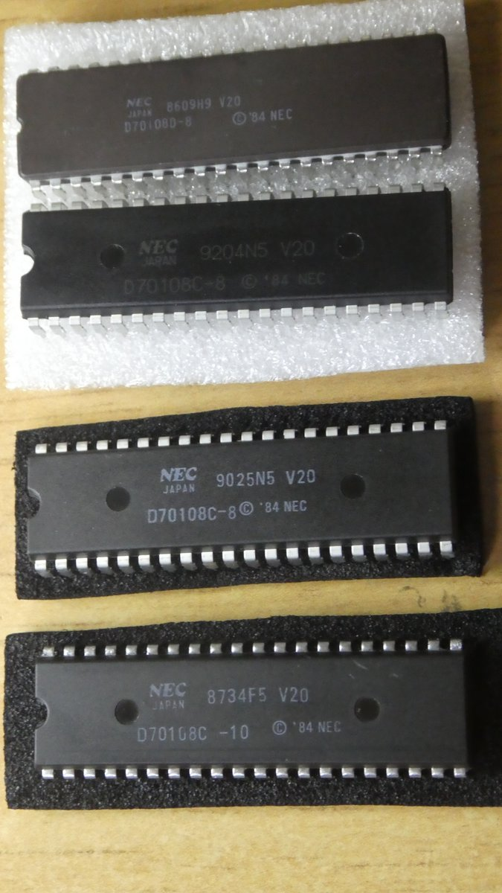

# EMU8088_57Q 
 
PIC18F47Q43はDIP40ピンで、電脳伝説さんがそれを使用したSBCであるEMUZ80を 
公開されたのがきっかけで、その後コアな愛好者によって、色々な拡張や 
新しいSBCが公開されています。 
 
PIC18F57Q43は、QFP48ピンのパッケージに収められており、仕様は47Qと変わりませんが、 
I/Oが8ピン多いのが特徴です。 
 
今回は、このPIC18F57Q43を使った8088/用のSBCを作成しました。 
V20はD70108D-8が動作します。 
メモリはAS6C4008(512kw x 8bit)を2個使用し、8088のフル空間（1MB）上で、 
CP/M-86が動作します。（将来的には、MS-DOSを動かしたい） 
 
EMU8088_57Q SBCボード

写真は、Rev1.5

Rev1.4とRev1.5(左側がRev1.4）

CP/M-86起動画面 

# 動作確認したCPU

V20は、D70108D-8での動作が確認出来ている。 
残念ながら、D70108C-8, D70108C-10では、動作が不安定でほとんど 
起動出来ていない。READY信号のタイミングはUPD70108のタイミングを 
満たすようにCLCの設計を詰めたつもりである。 
IOアクセスとメモリアクセスが干渉してると思われるが、起動時の 
ワークエリアアドレスを変えたりすると起動出来たりする。 
原因は掴めていない。 
 
まぁ、このSBCは、Z80エミュレーションをすることは、目的ではないので、 
原因の追及は別の機会に持ち越しで、ペンディングとしたい。 
誰か分かる方がいらっしゃったら、連絡いただけるとありがたいです。 
 
試したV20（安定して動作したのはD70108D-8）

# ファームウェア
@hanyazouさんが作成したZ80で動作しているCP/M-80のFWをベースに 
EMU8088/V20_57Q0用のFWとして動作するように修正を加え、CP/M-86を 
インプリメントしました。 
 
FWのI/Oモジュールは、ほぼ新設計となります。 
DISK I/OとFatFs、及びSPIについては、ほぼ未修整で使用しています。 
 
FWのソースのコンパイルは、マイクロチップ社の 
 
「MPLAB® X Integrated Development Environment (IDE)」 
 
を使っています。（MPLAB X IDE v6.10）コンパイラは、XC8を使用しています。 
https://www.microchip.com/en-us/tools-resources/develop/mplab-x-ide 
 
8088/V20用のアセンブラは、Macro Assembler AS V1.42を使用しています。 
http://john.ccac.rwth-aachen.de:8000/as/ 
 
FatFsはR0.15を使用しています。 
＜FatFs - Generic FAT Filesystem Module＞ 
http://elm-chan.org/fsw/ff/00index_e.html 
 
SDカード上のCP/Mイメージファイルの作成は、CpmtoolsGUIを利用しています。 
＜CpmtoolsGUI - neko Java Home Page＞ 
http://star.gmobb.jp/koji/cgi/wiki.cgi?page=CpmtoolsGUI 
 
 
＜＠hanyazouさんのソース＞ 
https://github.com/hanyazou/SuperMEZ80/tree/mez80ram-cpm 
 
 
＜@electrelicさんのユニバーサルモニタ＞ 
https://electrelic.com/electrelic/node/1317 
 
 
＜参考＞ 
・EMUZ80 
EUMZ80はZ80CPUとPIC18F47Q43のDIP40ピンIC2つで構成されるシンプルなコンピュータです。 
 
＜電脳伝説 - EMUZ80が完成＞   
https://vintagechips.wordpress.com/2022/03/05/emuz80_reference   
＜EMUZ80専用プリント基板 - オレンジピコショップ＞   
https://store.shopping.yahoo.co.jp/orangepicoshop/pico-a-051.html 
 
・SuperMEZ80 
SuperMEZ80は、EMUZ80にSRAMを追加し、Z80をノーウェイトで動かすことができるメザニンボードです 
 
SuperMEZ80 
https://github.com/satoshiokue/SuperMEZ80 
 
